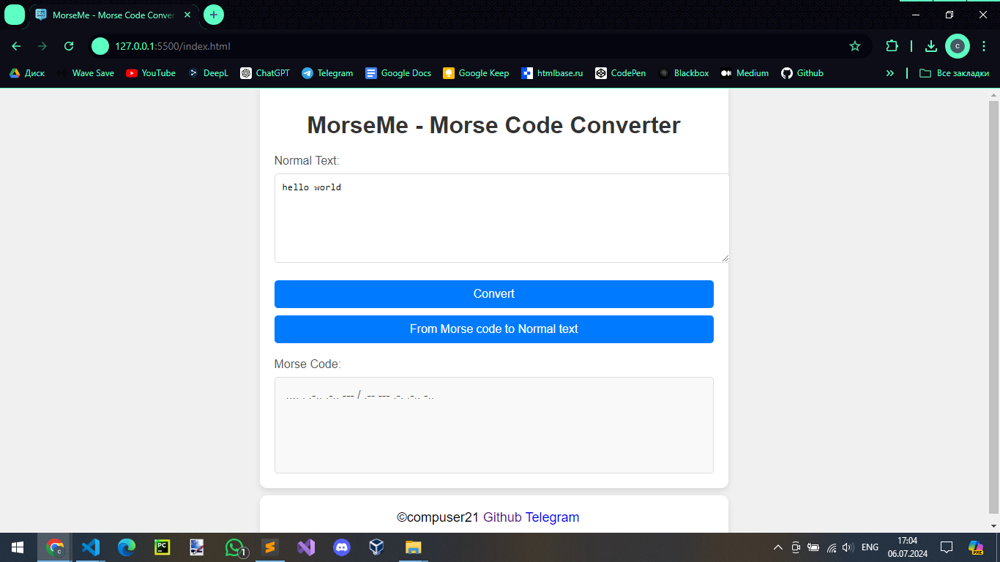
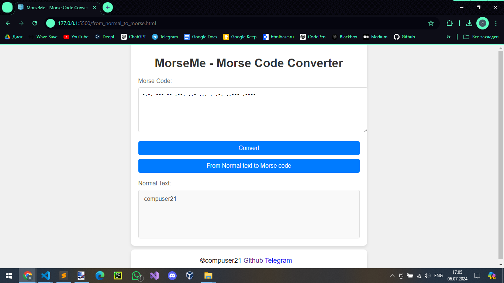

# MorseMe

Welcome to the Morse Code Converter GitHub repository! This application allows users to easily convert text to Morse code and Morse code back to text.

Link: (https://morseme.vercel.app/)

## Features

- Text to Morse Code Conversion: Input any text and get the corresponding Morse code.
- Morse Code to Text Conversion: Input Morse code and get the corresponding text.
- User-Friendly Interface: Simple and intuitive design for easy usage.

## Screenshots

 

Feel free to explore, use, and contribute to the Morse Code Converter! If you have any questions or issues, please open an issue in this repository.
